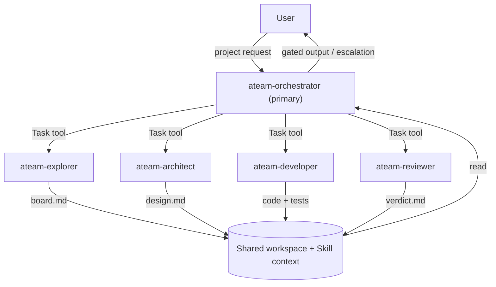
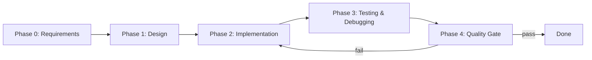

# ATEAM — Multi-Agent Project Delivery Framework

## 1. Executive Summary

ATEAM is a reusable multi-agent framework for end-to-end agentic project delivery (requirement analysis → design → implement/test/debug → quality gating), built on **OpenCode** as the execution engine.

The framework defines agent roles, workflow orchestration, document-based coordination patterns, and an installation/distribution mechanism that makes it trivially reusable across projects.

**Key insight:** OpenCode supports configurable primary agents + invokable subagents (via the Task tool) but does not ship a built-in orchestration runtime. ATEAM encodes the orchestration logic into a `primary` Orchestrator agent, a set of `subagent` workers, and a Skill that provides the full workflow context.

---

## 2. Architecture

### 2.1 High-Level Design



### 2.2 Core Concept: OpenCode as Execution Engine

- **Primary agent**: `ateam-orchestrator` — the user converses with it directly; it plans, delegates, and gates
- **Subagents**: `ateam-architect`, `ateam-developer`, `ateam-reviewer`, `ateam-explorer` — invoked by the orchestrator via the Task tool, or by the user via `@mention`
- **Skill**: `ateam` — loaded on-demand by the orchestrator; provides the full workflow context (phases, coordination rules, board templates, escalation policy)
- **Coordination**: Document-based via board files in `boards/` directory
- **No external wrapper**: All orchestration lives in agent prompts and the Skill — no `opencode run`/`serve` wrapper

### 2.3 Agent Set

| Agent | Mode | Purpose | Can Edit | Can Bash |
|-------|------|---------|----------|----------|
| `ateam-orchestrator` | primary | Plan, delegate, gate, escalate | ask | ask |
| `ateam-architect` | subagent | System design, no code | allow | deny |
| `ateam-developer` | subagent | Implementation + tests | allow | allow |
| `ateam-reviewer` | subagent | Quality gate, read-only | deny | deny |
| `ateam-explorer` | subagent | Research, inspection | deny | deny |

---

## 3. Distribution & Consumption Strategy

### 3.1 Design Goals

| Goal | Approach |
|------|----------|
| **Zero setup per project** | Global install (`~/.config/opencode/`) makes agents available everywhere |
| **Project-committed customization** | Per-project install (`.opencode/agents/`) for team-shared, version-controlled config |
| **Flexible activation** | `ateam.active_agents` list in project `opencode.json` controls which agents are usable |
| **Overridable defaults** | Sensible default models; users override in `opencode.json` |
| **One-command install** | `install.sh` supports both global and per-project modes |

### 3.2 Two Install Modes

**Global mode** — agents + skill available in ALL projects:
```bash
./install.sh --global
# Copies agents → ~/.config/opencode/agents/ateam-*.md
# Copies skill  → ~/.config/opencode/skills/ateam/SKILL.md
```
After install: open any project, `Tab` → `ateam-orchestrator`, describe your project. Zero per-project files needed.

**Per-project mode** — agents + skill committed to a specific project:
```bash
./install.sh --project ~/code/my-app
# Copies agents → my-app/.opencode/agents/ateam-*.md
# Copies skill  → my-app/.opencode/skills/ateam/SKILL.md
# Scaffolds     → my-app/opencode.json (if absent)
```
Team shares the agent config via git; customize per project.

### 3.3 Per-Project Activation

Inside a project's `opencode.json`:
```json
{
  "ateam": {
    "active_agents": ["orchestrator", "architect", "developer", "reviewer"]
  }
}
```
- The Orchestrator reads this list on startup and only delegates to agents present in the list
- Remove entries to deactivate agents not needed for the project
- If absent, all agents in the orchestrator's `permission.task` allowlist are active

### 3.4 Model Overrides

Sensible defaults are provided. Override in `opencode.json`:
```json
{
  "agent": {
    "ateam-developer": { "model": "openai/gpt-5" }
  }
}
```

### 3.5 Consumption UX

```
# One-time setup:
cd ateam && ./install.sh --global

# Every new project thereafter:
opencode my-project/
# Tab → "ateam-orchestrator"
# Type: "Start a new project: <description>"
# Orchestrator loads the ateam skill and runs Phase 0 → 4
```

---

## 4. Agent Role Definitions

### 4.1 Orchestrator (`ateam-orchestrator`)

**Role:** The conductor. Communicates with the user, decomposes tasks, spawns workers, reviews outputs, and gates progress.

**Config:**
- `mode: primary`
- `model: anthropic/claude-sonnet-4-20250514` (strong reasoning model; overridable)
- `steps: 40`
- `permission.task`: denies `*`, allows the four `ateam-*` workers

**Key behaviors:**
1. Load the ateam skill at session start for full workflow context
2. Read `opencode.json` for `ateam.active_agents` to determine which agents are active
3. Maintain the master board: `boards/orchestrator/<project>/board.md`
4. Control the implement/refine → review cycle (MAX_REVIEW_ITERATIONS = 3)
5. Escalate to user when stuck

### 4.2 Architect (`ateam-architect`)

**Role:** Deep system analysis and design. No coding or testing.

**Config:**
- `mode: subagent`
- `model: anthropic/claude-sonnet-4-20250514`
- `temperature: 0.2`
- `permission`: edit allow, bash deny

**Output:** Design document to `boards/architect/<task_id>/board.md`

### 4.3 Developer (`ateam-developer`)

**Role:** Implementation, testing, debugging. The hands-on coder.

**Config:**
- `mode: subagent`
- `model: opencode/gpt-5.1-codex` (code-specialized)
- `steps: 30`
- `permission`: edit allow, bash allow, webfetch allow

**Output:** Code changes + test results in `boards/developer/<task_id>/board.md`

### 4.4 Reviewer (`ateam-reviewer`)

**Role:** Skeptical quality gate for all stage outputs.

**Config:**
- `mode: subagent`
- `model: anthropic/claude-sonnet-4-20250514`
- `temperature: 0.1`
- `permission`: edit deny, bash deny, webfetch allow (read-only gate)

**Output:** Verdict (APPROVED / NEEDS_REVISION) in `boards/reviewer/<task_id>/board.md`

### 4.5 Explorer (`ateam-explorer`)

**Role:** Quick, focused information gathering. Research, codebase inspection, fact-finding.

**Config:**
- `mode: subagent`
- `model: anthropic/claude-haiku-4-20250514` (fast/cheap)
- `steps: 5`
- `permission`: edit deny, bash deny, webfetch allow, websearch allow

**Output:** Findings in `boards/explorer/<task_id>/board.md`

---

## 5. Workflow Design

### 5.1 Phase Structure



| Phase | Owner | Deliverable |
|-------|-------|-------------|
| 0: Requirements | Orchestrator (+ Explorer) | Clarified requirements in master board |
| 1: Design | Architect | Design document, reviewed by Reviewer |
| 2: Implementation | Developer | Code + tests, gated by Reviewer |
| 3: Testing & Debugging | Developer | Test results + fixes |
| 4: Quality Gate | Reviewer | Final verdict against original requirements |

### 5.2 Implement/Refine → Review Cycle

```
1. Orchestrator defines task → delegates to Developer via Task tool
2. Developer implements + updates its task board
3. Orchestrator delegates to Reviewer via Task tool
4. Reviewer evaluates against task goal, project goals, original requirements
5. Reviewer writes verdict → APPROVED or NEEDS_REVISION
6. If APPROVED → proceed to next task/phase
7. If NEEDS_REVISION → re-delegate to Developer with Reviewer's feedback
8. Loop to step 2. After MAX_REVIEW_ITERATIONS (3) without APPROVED → escalate to user
```

### 5.3 Document-Based Coordination

All cross-agent coordination is document-based via board files:

```
boards/
├── orchestrator/<project>/board.md     # Master board (phase progress, decisions)
├── architect/<task_id>/board.md        # Design documents
├── developer/<task_id>/board.md        # Implementation progress
├── reviewer/<task_id>/board.md         # Review verdicts
└── explorer/<task_id>/board.md         # Research findings
```

- The Orchestrator always updates the master board before delegating
- Subagents write outputs to their board file
- The Orchestrator reads board files to track progress and make decisions
- Board templates are defined in the ateam Skill

### 5.4 Escalation Policy

The Orchestrator escalates to the user when:
1. Review cycle exhausted (3 iterations without APPROVED)
2. Ambiguous requirements cannot be clarified
3. Architecture conflicts arise (Developer needs to diverge from design)
4. Agent step caps reached before completion
5. User interrupts at any time

---

## 6. Skill Design

The `ateam` skill (`skills/ateam/SKILL.md`) is the workflow intelligence layer — separate from agent role definitions. It contains:

- **Phase definitions**: Detailed descriptions of all 5 phases
- **Coordination rules**: Board file layout, naming conventions, communication conventions
- **Review cycle**: The implement/refine → review loop with MAX_REVIEW_ITERATIONS
- **Board templates**: Master board, task board, review verdict format
- **Escalation policy**: When and how to escalate
- **Activation config**: How `ateam.active_agents` is read and respected

**Why a skill vs agent prompts:** The skill is loaded on-demand — it doesn't bloat every agent's context. The orchestrator loads it once at session start. It can be updated independently from agent role definitions. Users can even use the skill with built-in agents for lightweight use.

---

## 7. Key Design Decisions

| Decision | Rationale |
|----------|-----------|
| **`ateam-` prefix on agent names** | Avoids name collisions when installed globally alongside user's other agents |
| **Skill for workflow, agents for roles** | Separates "what to do" (skill) from "who does it" (agents); skill is independently updatable |
| **Two install modes (global + per-project)** | Global = zero-setup; per-project = team-committed, customizable |
| **`active_agents` list for activation** | Simple UX — edit a list, not permission blocks; orchestrator reads and respects it |
| **Sensible defaults + override** | Works out of the box; users override models in `opencode.json` |
| **Document-based coordination** | Explicit, auditable, works across async Task invocations |
| **Orchestrator is the only `primary` agent** | One entry point for the user; all workers are subagents |
| **Reviewer as read-only gatekeeper** | Cannot edit files, so verdicts stay unbiased |
| **`steps` caps on every agent** | Bounds cost; orchestrator escalates to user when exhausted |
| **MAX_REVIEW_ITERATIONS = 3 → escalate** | Prevents endless implement/refine loops |
| **Orchestration in prompts + skill, not a wrapper script** | Idiomatic OpenCode usage; no external process spawning |

---

## 8. Repository Structure

```
ateam/
├── doc/
│   ├── prj_goal.md                    # Original project goal
│   └── design.md                      # This document
├── agents/                            # Agent definition source files
│   ├── ateam-orchestrator.md
│   ├── ateam-architect.md
│   ├── ateam-developer.md
│   ├── ateam-reviewer.md
│   └── ateam-explorer.md
├── skills/
│   └── ateam/
│       └── SKILL.md                   # Workflow skill
├── scaffold/
│   └── opencode.json.snippet          # Minimal per-project config template
├── install.sh                         # One-command installer
└── README.md                          # (to be created)
```

### Installation targets

| Source | Global target | Per-project target |
|--------|--------------|-------------------|
| `agents/*.md` | `~/.config/opencode/agents/` | `<project>/.opencode/agents/` |
| `skills/ateam/SKILL.md` | `~/.config/opencode/skills/ateam/` | `<project>/.opencode/skills/ateam/` |
| `scaffold/opencode.json.snippet` | N/A | `<project>/opencode.json` (if absent) |

---

## 9. OpenCode Feature Alignment

| Design Aspect | OpenCode Mechanism | Status |
|---------------|-------------------|--------|
| Agent definition | `~/.config/opencode/agents/*.md` or `.opencode/agents/*.md` | ✅ Aligned |
| Primary vs subagent | `mode: primary` / `subagent` | ✅ Aligned |
| Leader→worker scoping | `permission.task` glob rules | ✅ Aligned |
| Workflow context | Skill loaded via `skill` tool | ✅ Aligned |
| Cross-agent communication | Shared workspace files | ✅ Aligned |
| Context management | `/compact` for long sessions | ✅ Aligned |
| Model override | `agent.<name>.model` in `opencode.json` | ✅ Aligned |

---

## 10. Next Steps

1. **Test global install**: Run `./install.sh --global`, verify agents appear in OpenCode
2. **Test per-project install**: Run `./install.sh --project <test-project>`, verify scaffolding
3. **POC run**: One small project, Phase 0+1 only (Orchestrator + Architect + Reviewer)
4. **Full pipeline**: Add Developer + Explorer, run the implement/refine → review loop
5. **Document results**: Record findings, iterate on prompts and skill content
